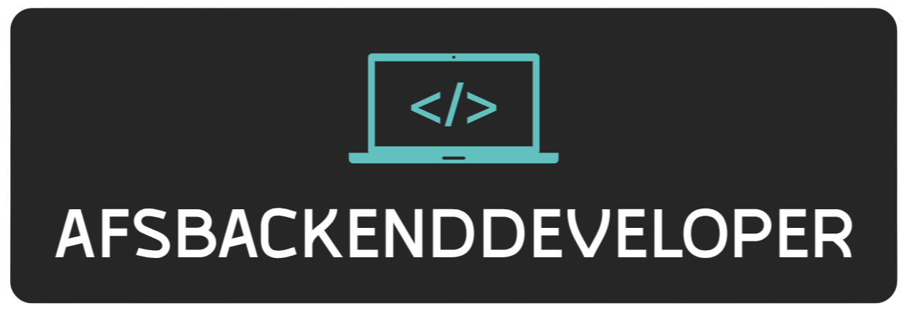

# Hi there! 👋 I'm Andrés Felipe Sarmiento Niño  

🚀 **Backend Developer** | Passionate about building robust and scalable systems  

---

## 🛠️ **Tech Stack**  
- **Languages:** JavaScript (Node.js 🟩)  
- **Frameworks:** Express ⚡  
- **Tools & Platforms:** Docker 🐳, MongoDB 🍃, GitHub 🐙  
- **CI/CD:** Automated deploys with GitHub Actions 🔄  
- **Docs:** Simple easy and clear documentation with the frameworks SwaggerJsDoc and SwaggerUiExpress
- **WebServer:** Reverse proxy to handle HTTP traffic.

---

## 💼 **About Me**  
I'm a backend developer specializing in creating scalable RESTful APIs and efficient server-side applications. With expertise in **Node.js**, **Express**, and **Docker**, I design systems that are both robust and maintainable.  

### 🧰 **My Key Skills**  
- Crafting RESTful APIs  
- Containerizing applications with Docker  
- Streamlining deployments via CI/CD pipelines
- Managing databases with MongoDB

---

## 📫 **Let's Connect!**
- **LinkedIn:** https://www.linkedin.com/in/afs-backend-dev
- **Portfolio:** https://portfolio.afsBackendDev.site  
- **Email:** AfsBackendDev@gmail.com
